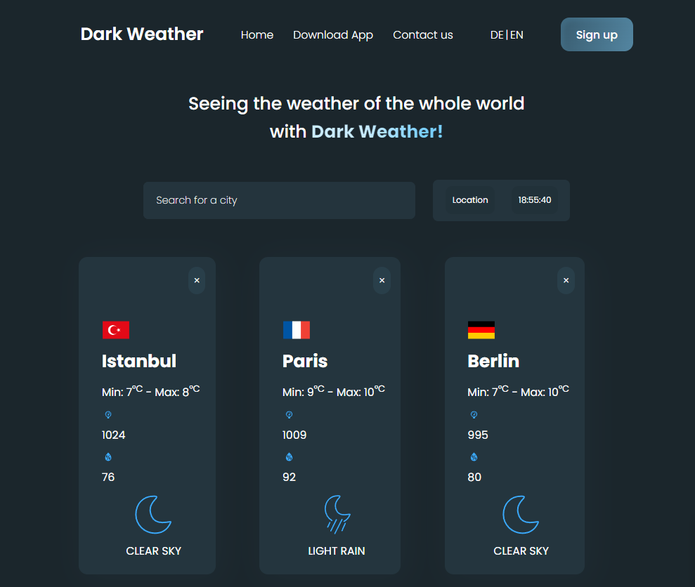
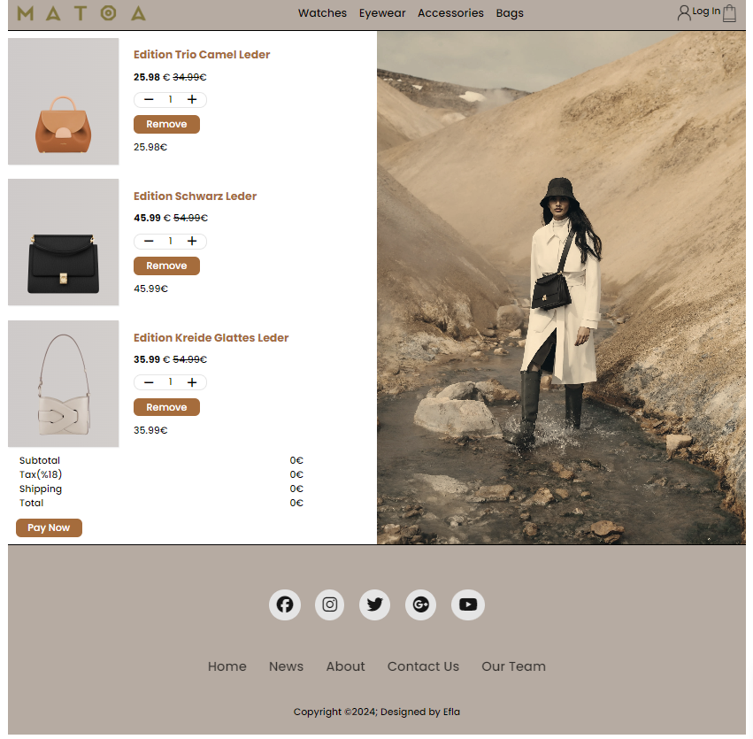

<h1> Hi! I'm Esra 👋</h1>
<h2> Welcome to my profile! </h2> 

<li> 💻 𝖨'𝗆 𝖥𝗋𝗈𝗇𝗍 𝖤𝗇𝖽 𝖣𝖾𝗏𝖾𝗅𝗈𝗉𝖾𝗋 </li>
<li> 🧠 𝖨'𝗆 𝖼𝗎𝗋𝗋𝖾𝗇𝗍𝗅𝗒 𝗅𝖾𝖺𝗋𝗇𝗂𝗇𝗀 React</li>
<li> 😍 I love programming, books and cats </li>
<li> :zap: I’m addicted to learning and growing every day</li>

 
<h2>Language and Tools</h2>

 
 

 

 
<h2 align="center">My Top Projects</h2>

	<table>
		<tr>
			<td width="50%">
				<h3 align="center">The Weather App</h3>
				
  
					
					 
					 
					

						  
						
					

					
<strong>HTML, CSS, Javascript</strong>

          

            A tool for car insurance companies to leverage Geotab telematics and location data to make better data-driven insurance premium pricing decisions.
					

				

			</td>
			<td width="50%">
				<h3 align="center">Checkout Page</h3>
				
  
					
					 
					 
					

						  
							
					

					 
<strong>HTML, CSS, Javascript</strong>

					
 WeTown is a web application that lets users only interact with other users in their neighborhood. Allowing individuals to connect with those within their communities. 

				

        </tr>
	    <tr>
            <td width="50%">
                <h3 align="center">Todo List</h3>
                
  
                    
                     
                     
                    

                         
						
                    

                    
<strong>HTML, CSS, Javascript</strong>

		    
A LIDAR prototype that maps out rooms by utilizing a time-of-flight sensor and a MSP432E401Y microcontroller programmed in C with the use of Keil µVision IDE.

                
	
            </td>
            <td width="50%">
                <h3 align="center">SASS Project</h3>
                
  
                    
                     
                     
                    

                          
						
                    

                    
<strong>HTML, CSS, Sass</strong>

		    
This is a rock, paper, and scissors game which I created to learn more about JavaScript and how to interact with components using DOM manipulation.

                

            </td>
        </tr>
	    <tr>
            <td width="50%">
                <h3 align="center">Bootstrap Project</h3>
                
  
                    
                     
                     
                    

                          
							
                    

                    
<strong>HTML, CSS, Bootsrap</strong>

		    
Fylo is a web template that I created targeting companies that provide online cloud services. This is available for anyone to use and showcase their business.

                
	
            </td>
        </tr>
	</table>

 
