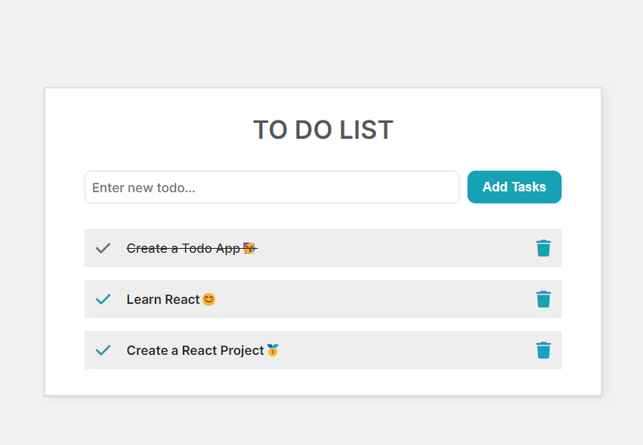

<h1> Hi! I'm Esra 👋</h1>
<h2> Welcome to my profile! </h2> 

<li> 💻 𝖨'𝗆 𝖥𝗋𝗈𝗇𝗍 𝖤𝗇𝖽 𝖣𝖾𝗏𝖾𝗅𝗈𝗉𝖾𝗋 </li>
<li> 🧠 𝖨'𝗆 𝖼𝗎𝗋𝗋𝖾𝗇𝗍𝗅𝗒 𝗅𝖾𝖺𝗋𝗇𝗂𝗇𝗀 React</li>
<li> 😍 I love programming, books and cats </li>
<li> :zap: I’m addicted to learning and growing every day</li>

 
<h2>Language and Tools</h2>

 
 

 

 
<h2 align="center">My Top Projects</h2>

	<table>
 <tr> <td width="50%">
				<h3 align="center">Tutorial App</h3>
				 
				
  
					
					 
					 
					

						  
						
					

					
<strong> REACT,NODE.JS,Express.js,MongoDB  </strong>

          

					

				

			</td>
	 <td width="50%">
				<h3 align="center">Stock App</h3>
				 
				
  
					
					 
					 
					

						  
						
					

					
<strong>Material UI,REACT.js,Redux </strong>

          

					

				

			</td>
    </tr>	

  
 <tr> <td width="50%">
				<h3 align="center">Shopping Card</h3>
				 
				
  
					
					 
					 
					

						  
						
					

					
<strong>HTML, CSS,Bootstrap, REACT  </strong>

          

					

				

			</td>
	 <td width="50%">
				<h3 align="center">Recipe App</h3>
				 
				
  
					
					 
					 
					

						  
						
					

					
<strong>HTML, CSS, REACT  </strong>

          

					

				

			</td>
    </tr>	
  
 <tr><td width="50%">
				<h3 align="center">Hospital Appointment</h3>
				 
				
  
					
					 
					 
					

						  
						
					

					
<strong>HTML, CSS, REACT  </strong>

          

					

				

			</td>
			<td width="50%">
				<h3 align="center">React-TODO</h3>
                                  
				
  
					
					 
					 
					

						  
							
					

					 
<strong>HTML, CSS, React </strong>

					
 

				

        </tr>	
	
<tr>
			<td width="50%">
				<h3 align="center">GS Legend</h3>
				 
				
  
					
					 
					 
					

						  
						
					

					
<strong>HTML, CSS, REACT-Bootstrap </strong>

          

					

				

			</td>
			<td width="50%">
				<h3 align="center">Horoscope</h3>
                                  
				
  
					
					 
					 
					

						  
							
					

					 
<strong>HTML, CSS, React, SASS</strong>

					
 

				

        </tr>	
		<tr>
			<td width="50%">
				<h3 align="center">The Weather App</h3>
				 
				
  
					
					 
					 
					

						  
						
					

					
<strong>HTML, CSS, Javascript</strong>

          

					

				

			</td>
			<td width="50%">
				<h3 align="center">Checkout Page</h3>
				
  
					
					 
					 
					

						  
							
					

					 
<strong>HTML, CSS, Javascript</strong>

					
 

				

        </tr>
	    <tr>
            <td width="50%">
                <h3 align="center">Todo List</h3>
                
  
                    
                     
                     
                    

                         
						
                    

                    
<strong>HTML, CSS, Javascript</strong>

		    

                
	
            </td>
            <td width="50%">
                <h3 align="center">SASS Project</h3>
                
  
                    
                     
                     
                    

                          
						
                    

                    
<strong>HTML, CSS, Sass</strong>

		    

                

            </td>
        </tr>
	 

<tr>
			<td width="50%">
				<h3 align="center">Bootstrap Project</h3>
				 
				
  
					
					 
					 
					

						  
						
					

					
<strong>HTML, CSS, Bootstrap</strong>

          

					

				

			</td>
        </tr>
	</table>

 
